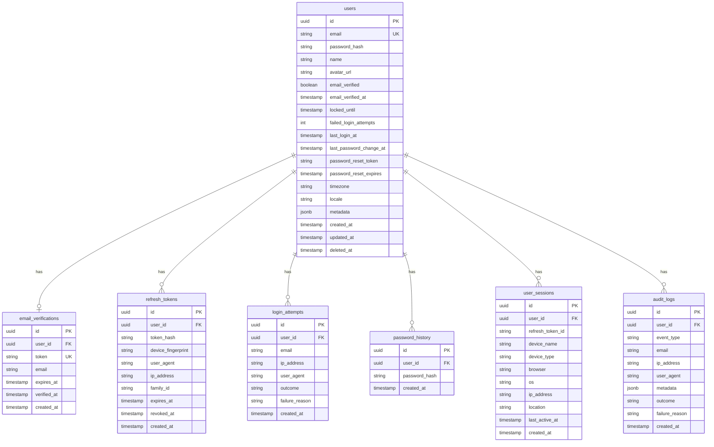

# Authentication Database Schema

## Design Philosophy

The authentication schema is designed with the following principles:

1. **Separation of concerns**: User profile data, authentication credentials, and session data are stored in separate tables.
2. **Audit readiness**: All authentication events are logged immutably.
3. **Extensibility**: The schema supports future features (MFA, OAuth, API keys) without migration pain.
4. **Performance**: Indexes are designed for the most common query patterns.
5. **Security**: Sensitive data (password hashes, token hashes) is stored in dedicated columns with restricted access.

## Entity Relationship Diagram

## Table Definitions

### 1. `users`

**Purpose**: Core user identity and authentication data. Stores profile information and authentication-related fields.

**Design Decisions**:
- `password_hash` is stored in the users table (not a separate credentials table) because we currently only support one authentication method. When OAuth is added, we'll create a `user_identities` table.
- `locked_until` is nullable. NULL means the account is not locked. A timestamp in the past also means not locked (checked via `locked_until IS NULL OR locked_until < NOW()`).
- `failed_login_attempts` is a counter that resets on successful login. This is a denormalization for performance (avoids COUNT query on login_attempts).
- `deleted_at` supports soft deletes for GDPR compliance. All related data is anonymized on "delete."
- `metadata` is a JSONB column for extensible user attributes (onboarding status, feature flags, etc.).

| Column | Type | Constraints | Description |
|---|---|---|---|
| id | UUID | PK, DEFAULT gen_random_uuid() | Primary identifier |
| email | VARCHAR(255) | NOT NULL, UNIQUE | User's email address |
| password_hash | VARCHAR(255) | NOT NULL | bcrypt hash of password |
| name | VARCHAR(100) | NOT NULL | Display name |
| avatar_url | VARCHAR(500) | NULLABLE | Profile picture URL |
| email_verified | BOOLEAN | NOT NULL, DEFAULT false | Email verification status |
| email_verified_at | TIMESTAMPTZ | NULLABLE | When email was verified |
| locked_until | TIMESTAMPTZ | NULLABLE | Account lockout expiration |
| failed_login_attempts | INTEGER | NOT NULL, DEFAULT 0 | Consecutive failed attempts |
| last_login_at | TIMESTAMPTZ | NULLABLE | Last successful login |
| last_password_change_at | TIMESTAMPTZ | NULLABLE | Last password change |
| password_reset_token | VARCHAR(255) | NULLABLE | Password reset token (hashed) |
| password_reset_expires | TIMESTAMPTZ | NULLABLE | Password reset expiration |
| timezone | VARCHAR(50) | NULLABLE, DEFAULT 'UTC' | User's timezone |
| locale | VARCHAR(10) | NULLABLE, DEFAULT 'en' | User's locale |
| metadata | JSONB | NOT NULL, DEFAULT '{}' | Extensible user attributes |
| created_at | TIMESTAMPTZ | NOT NULL, DEFAULT NOW() | Account creation timestamp |
| updated_at | TIMESTAMPTZ | NOT NULL, DEFAULT NOW() | Last update timestamp |
| deleted_at | TIMESTAMPTZ | NULLABLE | Soft delete timestamp |

**Indexes**:
- `idx_users_email` on `email` (UNIQUE) — fast login lookup
- `idx_users_deleted_at` on `deleted_at` — filter soft-deleted users
- `idx_users_created_at` on `created_at` — user registration analytics

**Cascade Rules**: When a user is hard-deleted (rare), all related records are deleted via CASCADE.

---

### 2. `email_verifications`

**Purpose**: Tracks email verification tokens for new registrations and email changes.

**Design Decisions**:
- The `token` column stores a SHA-256 hash of the verification token, not the raw token. The raw token is sent to the user via email.
- `email` is stored separately from the user's current email to support email change flows (verify new email before updating).
- `verified_at` is NULL until the email is verified. NULL means pending verification.
- Tokens expire after 24 hours (enforced by application logic and a TTL index).

| Column | Type | Constraints | Description |
|---|---|---|---|
| id | UUID | PK, DEFAULT gen_random_uuid() | Primary identifier |
| user_id | UUID | NOT NULL, FK -> users(id) ON DELETE CASCADE | User who owns this verification |
| token | VARCHAR(255) | NOT NULL, UNIQUE | SHA-256 hash of verification token |
| email | VARCHAR(255) | NOT NULL | Email being verified |
| expires_at | TIMESTAMPTZ | NOT NULL | Token expiration timestamp |
| verified_at | TIMESTAMPTZ | NULLABLE | When the email was verified |
| created_at | TIMESTAMPTZ | NOT NULL, DEFAULT NOW() | Record creation timestamp |

**Indexes**:
- `idx_email_verifications_token` on `token` (UNIQUE) — fast token lookup during verification
- `idx_email_verifications_user_id` on `user_id` — find all verifications for a user
- `idx_email_verifications_expires_at` on `expires_at` — clean up expired tokens

**Foreign Keys**:
- `user_id` → `users(id)` ON DELETE CASCADE

---

### 3. `refresh_tokens`

**Purpose**: Stores refresh token hashes for session management and token rotation.

**Design Decisions**:
- `token_hash` stores SHA-256 hash of the raw refresh token. The raw token is only returned once during creation and is never stored.
- `family_id` groups related tokens for rotation tracking. When a token is rotated, the new token shares the same family_id.
- `device_fingerprint` allows binding tokens to specific devices for additional security.
- `revoked_at` is NULL for active tokens. A non-NULL value indicates the token was explicitly revoked.
- Expired tokens are cleaned up by a background job.

| Column | Type | Constraints | Description |
|---|---|---|---|
| id | UUID | PK, DEFAULT gen_random_uuid() | Primary identifier |
| user_id | UUID | NOT NULL, FK -> users(id) ON DELETE CASCADE | User who owns this token |
| token_hash | VARCHAR(255) | NOT NULL, UNIQUE | SHA-256 hash of refresh token |
| device_fingerprint | VARCHAR(255) | NULLABLE | Device identifier |
| user_agent | TEXT | NULLABLE | Browser user agent string |
| ip_address | INET | NULLABLE | IP address that created the token |
| family_id | UUID | NOT NULL | Token family for rotation tracking |
| expires_at | TIMESTAMPTZ | NOT NULL | Token expiration (7 days from creation) |
| revoked_at | TIMESTAMPTZ | NULLABLE | When the token was revoked |
| created_at | TIMESTAMPTZ | NOT NULL, DEFAULT NOW() | Record creation timestamp |

**Indexes**:
- `idx_refresh_tokens_token_hash` on `token_hash` (UNIQUE) — fast token lookup during refresh
- `idx_refresh_tokens_user_id` on `user_id` — find all tokens for a user (logout all)
- `idx_refresh_tokens_family_id` on `family_id` — token rotation tracking
- `idx_refresh_tokens_expires_at` on `expires_at` — clean up expired tokens
- `idx_refresh_tokens_user_id_expires_at` on `(user_id, expires_at)` — composite index for active token queries

**Foreign Keys**:
- `user_id` → `users(id)` ON DELETE CASCADE

**Unique Constraints**:
- `token_hash` is UNIQUE to prevent hash collisions and ensure fast lookups.

---

### 4. `login_attempts`

**Purpose**: Immutable audit log of all login attempts (successful and failed).

**Design Decisions**:
- This is an append-only table. Records are never updated or deleted (except for GDPR purges).
- `email` is stored separately from `user_id` because failed attempts may reference emails that don't exist in the users table (preventing email enumeration).
- `outcome` is an enum: `SUCCESS`, `FAILURE`, `LOCKED`, `RATE_LIMITED`.
- `failure_reason` provides specific error codes for analysis (e.g., `INVALID_PASSWORD`, `ACCOUNT_LOCKED`, `EMAIL_NOT_VERIFIED`).

| Column | Type | Constraints | Description |
|---|---|---|---|
| id | UUID | PK, DEFAULT gen_random_uuid() | Primary identifier |
| user_id | UUID | NULLABLE, FK -> users(id) ON DELETE SET NULL | User ID (NULL if email doesn't exist) |
| email | VARCHAR(255) | NOT NULL | Email used in attempt |
| ip_address | INET | NOT NULL | IP address of the attempt |
| user_agent | TEXT | NULLABLE | Browser user agent |
| outcome | VARCHAR(20) | NOT NULL | SUCCESS, FAILURE, LOCKED, RATE_LIMITED |
| failure_reason | VARCHAR(50) | NULLABLE | Specific failure reason code |
| created_at | TIMESTAMPTZ | NOT NULL, DEFAULT NOW() | Attempt timestamp |

**Indexes**:
- `idx_login_attempts_email_created` on `(email, created_at DESC)` — find recent attempts for an email
- `idx_login_attempts_ip_created` on `(ip_address, created_at DESC)` — find recent attempts from an IP
- `idx_login_attempts_user_id` on `user_id` — find all attempts for a user
- `idx_login_attempts_created_at` on `created_at` — time-based queries and cleanup

**Foreign Keys**:
- `user_id` → `users(id)` ON DELETE SET NULL (preserves audit trail even if user is deleted)

---

### 5. `password_history`

**Purpose**: Enforces password reuse policy (last 5 passwords).

**Design Decisions**:
- Stores bcrypt hashes of previous passwords. Plaintext passwords are never stored.
- The last 5 entries per user are checked during password change.
- Old entries beyond 5 are automatically pruned (application logic, not DB trigger).
- This table is append-only. Records are never updated.

| Column | Type | Constraints | Description |
|---|---|---|---|
| id | UUID | PK, DEFAULT gen_random_uuid() | Primary identifier |
| user_id | UUID | NOT NULL, FK -> users(id) ON DELETE CASCADE | User who owned this password |
| password_hash | VARCHAR(255) | NOT NULL | bcrypt hash of previous password |
| created_at | TIMESTAMPTZ | NOT NULL, DEFAULT NOW() | When this password was set |

**Indexes**:
- `idx_password_history_user_id_created` on `(user_id, created_at DESC)` — get recent password history

**Foreign Keys**:
- `user_id` → `users(id)` ON DELETE CASCADE

---

### 6. `user_sessions`

**Purpose**: Provides a user-facing view of active sessions for session management UI.

**Design Decisions**:
- This is a denormalized view of active refresh tokens, optimized for display.
- `device_name`, `device_type`, `browser`, `os` are parsed from the user agent string.
- `location` is derived from IP address (optional, via GeoIP service).
- `last_active_at` is updated on each token refresh to show session freshness.

| Column | Type | Constraints | Description |
|---|---|---|---|
| id | UUID | PK, DEFAULT gen_random_uuid() | Primary identifier |
| user_id | UUID | NOT NULL, FK -> users(id) ON DELETE CASCADE | User who owns this session |
| refresh_token_id | UUID | NOT NULL, FK -> refresh_tokens(id) ON DELETE CASCADE | Associated refresh token |
| device_name | VARCHAR(255) | NULLABLE | Human-readable device name |
| device_type | VARCHAR(50) | NULLABLE | mobile, tablet, desktop |
| browser | VARCHAR(100) | NULLABLE | Browser name and version |
| os | VARCHAR(100) | NULLABLE | Operating system |
| ip_address | INET | NULLABLE | Last known IP address |
| location | VARCHAR(255) | NULLABLE | Approximate geographic location |
| last_active_at | TIMESTAMPTZ | NOT NULL, DEFAULT NOW() | Last activity timestamp |
| created_at | TIMESTAMPTZ | NOT NULL, DEFAULT NOW() | Session creation timestamp |

**Indexes**:
- `idx_user_sessions_user_id` on `user_id` — find all sessions for a user
- `idx_user_sessions_refresh_token_id` on `refresh_token_id` (UNIQUE) — one session per token
- `idx_user_sessions_last_active` on `last_active_at` — sort by activity

**Foreign Keys**:
- `user_id` → `users(id)` ON DELETE CASCADE
- `refresh_token_id` → `refresh_tokens(id)` ON DELETE CASCADE

---

### 7. `audit_logs`

**Purpose**: Immutable audit trail for all authentication events.

**Design Decisions**:
- This is an append-only table. Records are never modified.
- `event_type` is an enum covering all auth events: `LOGIN_SUCCESS`, `LOGIN_FAILURE`, `LOGOUT`, `TOKEN_REFRESH`, `TOKEN_REVOKE`, `PASSWORD_CHANGE`, `PASSWORD_RESET_REQUEST`, `PASSWORD_RESET_COMPLETE`, `EMAIL_VERIFICATION`, `EMAIL_CHANGE`, `ACCOUNT_LOCKED`, `ACCOUNT_UNLOCKED`, `REGISTRATION`, `MFA_ENABLED`, `MFA_DISABLED`.
- `metadata` is a JSONB column for event-specific data (e.g., MFA method used, token family ID, etc.).
- Retention is managed by a background job that archives/deletes records older than the retention period.

| Column | Type | Constraints | Description |
|---|---|---|---|
| id | UUID | PK, DEFAULT gen_random_uuid() | Primary identifier |
| user_id | UUID | NULLABLE, FK -> users(id) ON DELETE SET NULL | User who performed the action |
| event_type | VARCHAR(50) | NOT NULL | Type of authentication event |
| email | VARCHAR(255) | NULLABLE | Email associated with the event |
| ip_address | INET | NOT NULL | IP address of the request |
| user_agent | TEXT | NULLABLE | Browser user agent |
| metadata | JSONB | NOT NULL, DEFAULT '{}' | Event-specific data |
| outcome | VARCHAR(20) | NOT NULL | SUCCESS or FAILURE |
| failure_reason | VARCHAR(50) | NULLABLE | Reason for failure |
| created_at | TIMESTAMPTZ | NOT NULL, DEFAULT NOW() | Event timestamp |

**Indexes**:
- `idx_audit_logs_user_id` on `user_id` — find all events for a user
- `idx_audit_logs_event_type` on `event_type` — filter by event type
- `idx_audit_logs_created_at` on `created_at` — time-based queries and cleanup
- `idx_audit_logs_user_id_event_type_created` on `(user_id, event_type, created_at DESC)` — composite index for common queries

**Foreign Keys**:
- `user_id` → `users(id)` ON DELETE SET NULL

## Migration Strategy

### Initial Schema
The initial migration creates all 7 tables with the indexes and constraints described above. This provides a complete authentication foundation from day one.

### Future Migrations
- **OAuth Support**: Add `user_identities` table (provider, provider_id, user_id FK).
- **MFA Support**: Add `user_mfa` table (method, secret, backup_codes, enabled).
- **API Keys**: Add `api_keys` table (key_hash, user_id, name, permissions, expires_at).
- **Rate Limiting**: Add `rate_limits` table for persistent rate limit tracking (if Redis is unavailable).

## Data Retention & Cleanup

| Table | Retention | Cleanup Strategy |
|---|---|---|
| login_attempts | 90 days | Background job deletes older records |
| audit_logs | 90 days (1 year for password changes) | Background job archives/deletes |
| refresh_tokens | 7 days (TTL) | Background job deletes expired + revoked |
| email_verifications | 24 hours (TTL) | Background job deletes expired |
| password_history | Last 5 per user | Application logic prunes on insert |
| user_sessions | Deleted with refresh token | CASCADE delete |