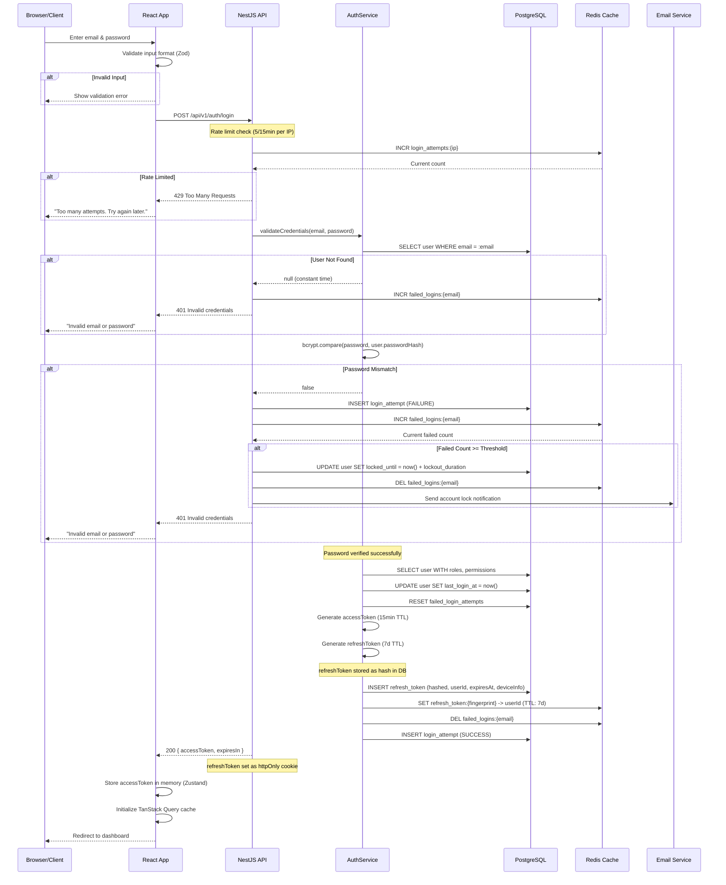

# Login Workflow

## Overview

The login workflow authenticates a user by verifying their email and password credentials, then issuing a token pair (access + refresh) for subsequent API requests.

## Sequence Diagram



## Step-by-Step Flow

### 1. Input Collection
- User enters email and password in the login form.
- React Hook Form with Zod schema validates input on the client side.
- Validation errors are displayed immediately without API call.

### 2. Rate Limiting Check
- Before processing credentials, the API checks IP-based rate limiting in Redis.
- If the IP has exceeded the limit (5 attempts in 15 minutes), a 429 response is returned.
- The client displays a "Too many attempts" message with retry-after information.

### 3. Credential Verification
- The API queries the user by email.
- If the user is not found, a constant-time response is returned to prevent email enumeration.
- The password is compared using bcrypt.compare().
- If the password is incorrect, the failed attempt counter is incremented.

### 4. Account Lockout Check
- Before credential verification, the system checks if the account is locked.
- If `locked_until` is in the future, the request is rejected with a lockout message.
- The lockout message does not reveal the lockout duration.

### 5. Token Generation
- On successful authentication, the system generates:
  - **Access Token**: JWT signed with RS256, 15-minute TTL
  - **Refresh Token**: Opaque token (cryptographically random), 7-day TTL
- The refresh token is hashed (SHA-256) before storage in PostgreSQL.
- The refresh token fingerprint is stored in Redis for fast lookup.

### 6. Response
- The access token is returned in the response body.
- The refresh token is set as an httpOnly, Secure, SameSite=Strict cookie.
- The client stores the access token in memory (Zustand store).
- The user is redirected to the dashboard.

## Error Handling

| HTTP Status | Error Code | Description | Client Action |
|---|---|---|---|
| 400 | VALIDATION_ERROR | Invalid email format or password | Show field-level errors |
| 401 | INVALID_CREDENTIALS | Email or password incorrect | Show generic error |
| 401 | ACCOUNT_LOCKED | Account temporarily locked | Show lockout message |
| 401 | EMAIL_NOT_VERIFIED | Email not verified | Redirect to verification |
| 429 | RATE_LIMITED | Too many requests | Show retry-after message |
| 500 | INTERNAL_ERROR | Server error | Show generic error |

## Token Response

```typescript
// Success Response (200)
{
  "accessToken": "eyJhbGciOiJSUzI1NiIs...",  // JWT, 15min TTL
  "expiresIn": 900,                              // seconds
  "user": {
    "id": "uuid",
    "email": "user@example.com",
    "name": "John Doe",
    "avatar": "https://...",
    "emailVerified": true
  }
}

// Refresh Token (Set-Cookie)
Set-Cookie: refresh_token=abc123...; HttpOnly; Secure; SameSite=Strict; Path=/api/v1/auth; Max-Age=604800
```

## Client-Side Token Storage

```typescript
// Zustand store for auth state
interface AuthState {
  accessToken: string | null;
  user: User | null;
  isAuthenticated: boolean;
  setTokens: (accessToken: string, user: User) => void;
  clearTokens: () => void;
}
```

- Access token is stored in a Zustand store (in-memory only).
- On page refresh, the client calls `POST /auth/refresh` to get a new access token.
- The refresh token cookie is automatically sent by the browser.
- No tokens are stored in localStorage or sessionStorage.