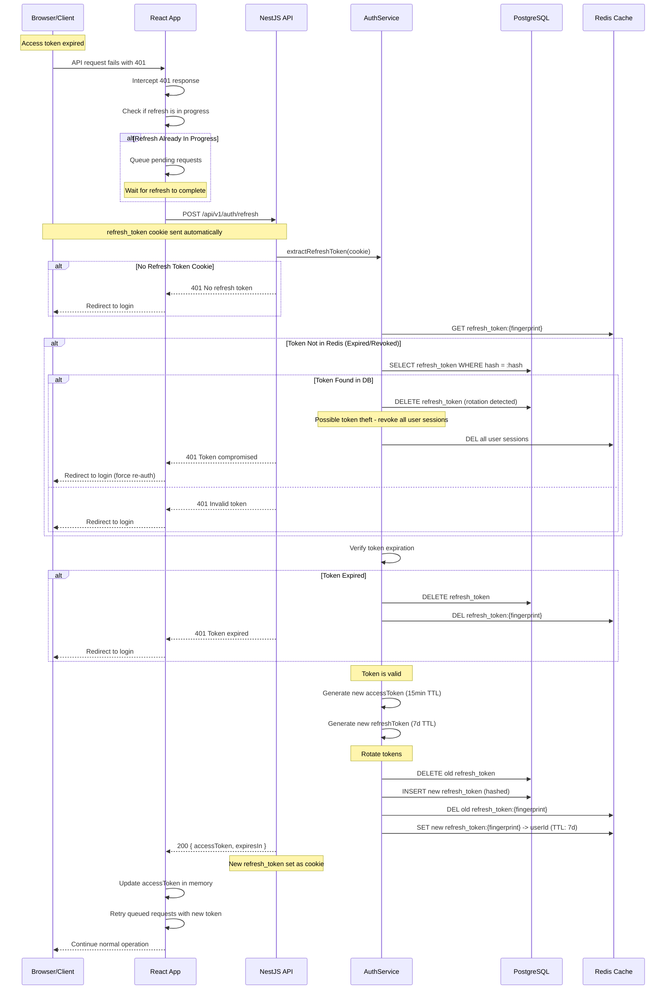

# Refresh Token Workflow

## Overview

The refresh token workflow allows clients to obtain a new access token without requiring the user to re-authenticate. It implements refresh token rotation for enhanced security: each time a refresh token is used, the old token is invalidated and a new token pair is issued.

## Sequence Diagram



## Token Rotation Strategy

### Why Rotation?
Refresh token rotation mitigates the risk of token theft. If an attacker steals a refresh token, they can only use it once before it's rotated. If the legitimate user's next refresh attempt fails (because the token was already used by the attacker), the system detects the theft and can take action.

### Rotation Flow
1. Client sends refresh token A.
2. Server validates token A.
3. Server issues token pair (B, C) where B is the new access token and C is the new refresh token.
4. Server invalidates token A.
5. If token A is used again (by an attacker), the server detects it as already rotated and revokes all tokens for the user.

### Token Theft Detection
```typescript
// Pseudocode for theft detection
async function refreshToken(oldTokenHash: string): Promise<TokenPair> {
  const storedToken = await db.query.refreshTokens.findFirst({
    where: eq(refreshTokens.hash, oldTokenHash),
  });

  if (!storedToken) {
    // Token was already rotated or never existed
    // This could indicate token theft
    await revokeAllUserSessions(storedToken.userId);
    throw new UnauthorizedException('Token compromised');
  }

  // Rotate: delete old, create new
  await db.delete(refreshTokens).where(eq(refreshTokens.id, storedToken.id));
  const newToken = await createRefreshToken(storedToken.userId);
  
  return {
    accessToken: generateAccessToken(storedToken.userId),
    refreshToken: newToken,
  };
}
```

## Concurrency Handling

Since multiple API calls may fail with 401 simultaneously, the client must handle concurrent refresh attempts:

```typescript
// Client-side refresh queue
let refreshPromise: Promise<TokenResponse> | null = null;

async function refreshAccessToken(): Promise<string> {
  if (refreshPromise) {
    // Refresh already in progress, wait for it
    return refreshPromise.then((res) => res.accessToken);
  }

  refreshPromise = apiClient.post('/auth/refresh')
    .then((res) => {
      refreshPromise = null;
      return res.data;
    })
    .catch((err) => {
      refreshPromise = null;
      throw err;
    });

  return refreshPromise.then((res) => res.accessToken);
}
```

## Error Handling

| HTTP Status | Error Code | Description | Client Action |
|---|---|---|---|
| 401 | NO_REFRESH_TOKEN | No refresh token cookie | Redirect to login |
| 401 | TOKEN_EXPIRED | Refresh token expired | Redirect to login |
| 401 | TOKEN_REVOKED | Token was revoked | Redirect to login |
| 401 | TOKEN_COMPROMISED | Possible token theft | Redirect to login, force re-auth |
| 429 | RATE_LIMITED | Too many refresh attempts | Retry with backoff |

## Security Considerations

1. **Refresh token is stored as httpOnly cookie**: Cannot be accessed by JavaScript, preventing XSS-based theft.
2. **Token rotation**: Each use invalidates the previous token.
3. **Theft detection**: If a rotated token is reused, all sessions are revoked.
4. **Maximum active tokens**: Users are limited to 10 active refresh tokens.
5. **Redis-backed denylist**: Allows fast token revocation without database queries.
6. **Fingerprint binding**: Refresh tokens are bound to a device fingerprint for additional security.